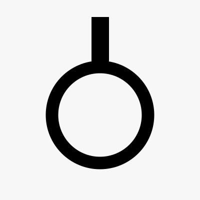
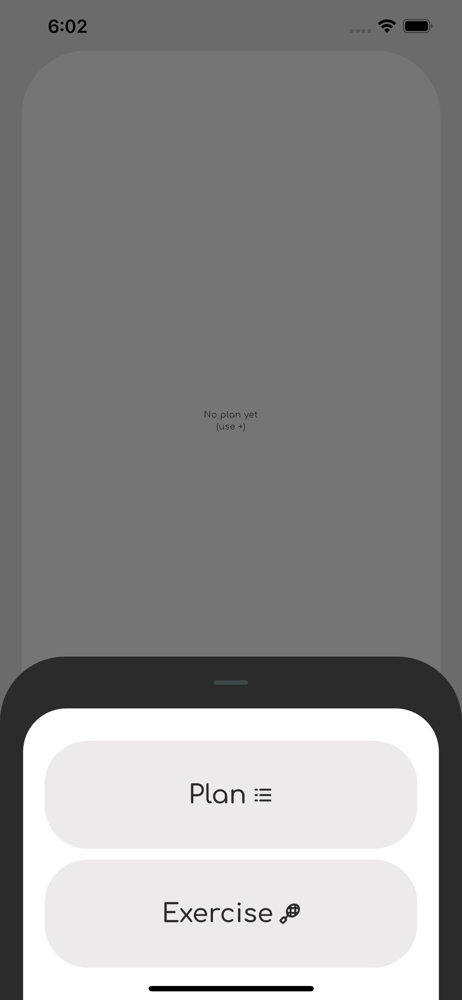
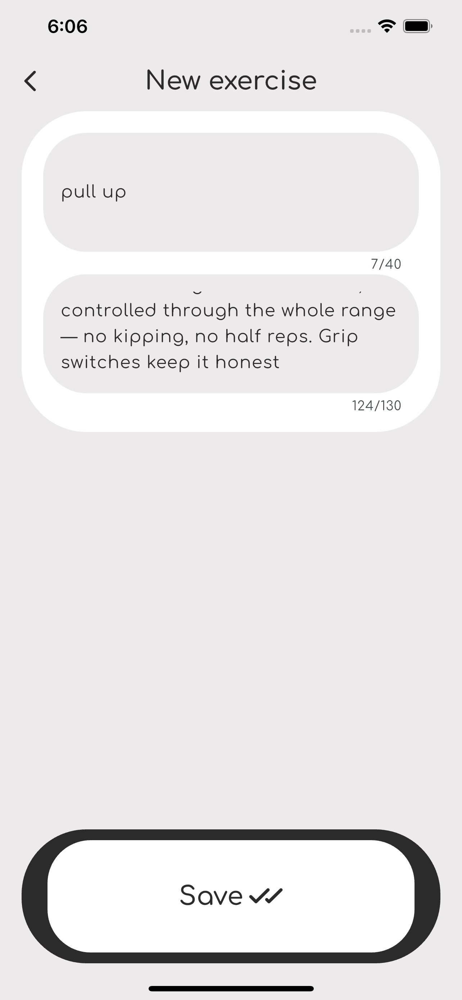
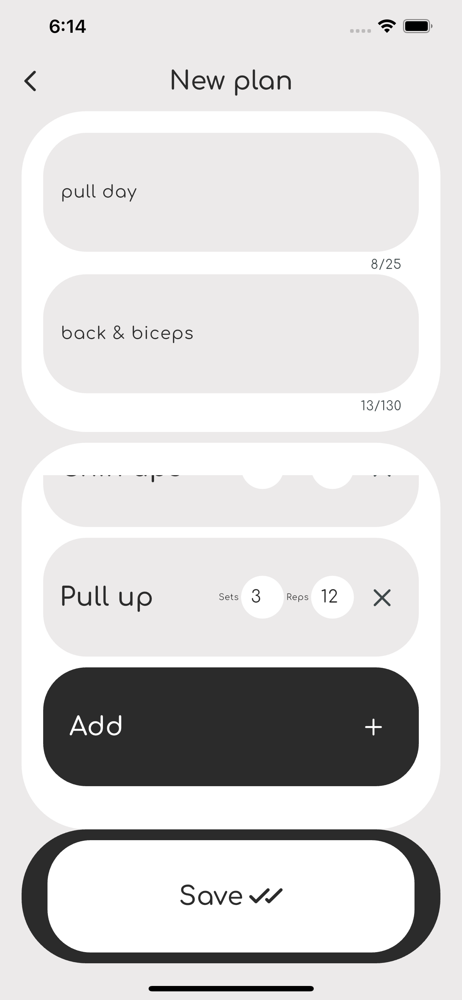
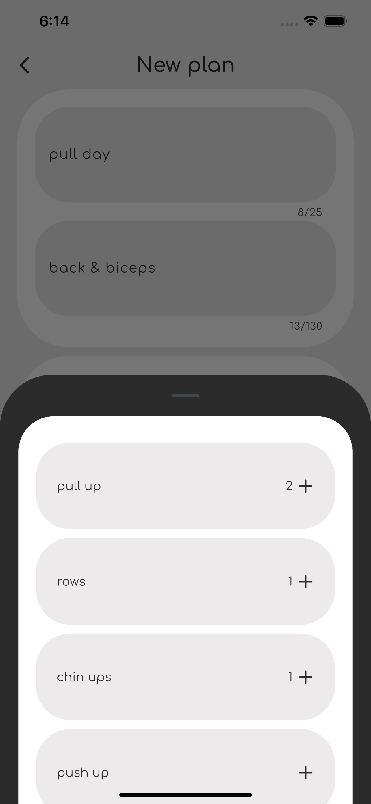
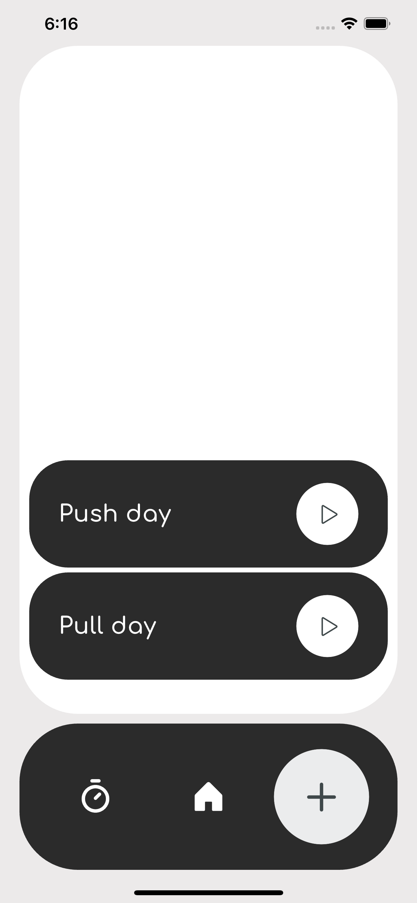
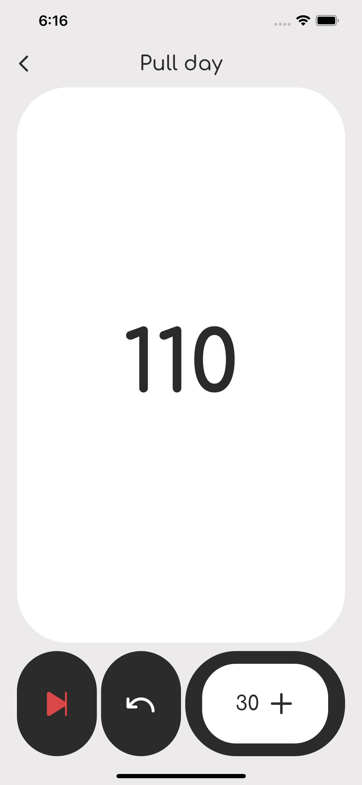
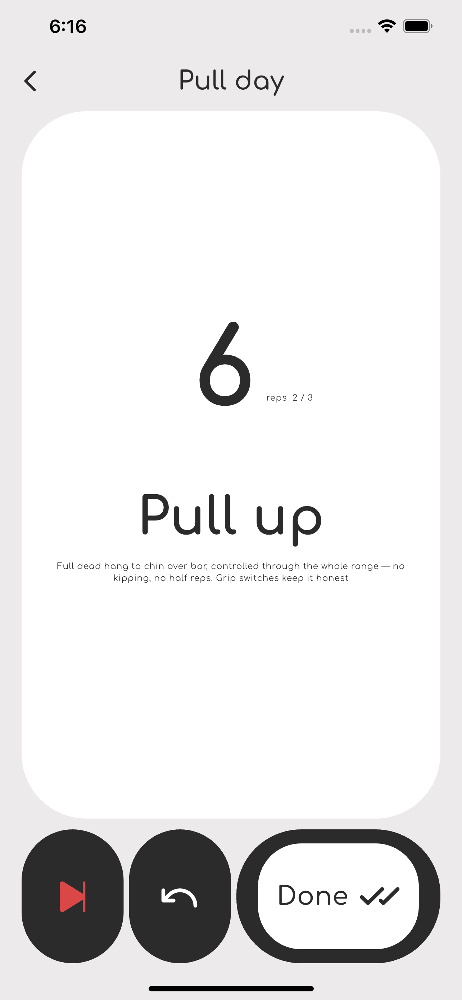

                             بسم الله الرحمن الرحيم

# رفق — Refq

**Simple, private fitness tracking.**

Refq is a minimal workout and fitness planner built for people who just want to train — not fight with an app. No ads, no accounts, no tracking. Add your own workouts, build your plans, mark them active, and let Refq take care of the rest, insha'Allah.

## Features

- 🏀 **Add your own workouts** — fully custom, no rigid templates
- 📋 **Build and manage plans** — mark a plan active and Refq tracks it for you
- 🔒 **100% private** — no accounts, no cloud, no data collection
- 📡 **Works offline** — everything stays on your device
- 🚫 **No ads, no junk**
- ✨ **Minimal, distraction-free design**

## Screenshots

| | | |
|---|---|---|
|  |  |  |
|  |  |  |
|  | | |

## Download

- **App Store:** _coming soon_
- **Google Play:** _unavailable for now_, have a look at: https://keepandroidopen.org/
- **android apk**: [github releases](releases/latest)

## Privacy

Refq is built privacy-first. No account is required, no data leaves your device, and nothing is tracked or sold. See [PRIVACY.md](PRIVACY.md) for the full policy.

## License

All rights reserved. This repository is provided for release/distribution purposes only. The source code is not licensed for reuse, modification, or redistribution.

© 2026 [Aqhwan / Refq]. All rights reserved.

---

Built with care, insha'Allah super easy to use. 🤍
